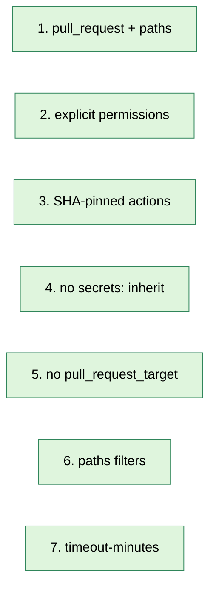

# Secure Your GitHub Actions

A practical checklist for shipping workflows that won't bite you later. Each rule has a *why*, a *do this*, and a *don't do this*, so you can spot violations during code review without thinking.

> If you're in a hurry, skip to [the safe-by-default boilerplate](#safe-by-default-boilerplate) at the bottom and copy-paste.

---

## TL;DR — the seven rules

| # | Rule | Closes this risk |
| --- | --- | --- |
| 1 | Start from a path-filtered `pull_request` template | Untrusted code running unnecessarily |
| 2 | Declare `permissions:` explicitly (default `contents: read`) | Token power growing silently |
| 3 | SHA-pin third-party actions — no `@main`, no `@v1` tag | Supply-chain takeover |
| 4 | Never use `secrets: inherit` in new workflows | Blast-radius bloat |
| 5 | No `pull_request_target` without infra review | Fork RCE with secrets |
| 6 | Add `paths:` filters | Wasted CI minutes |
| 7 | Add `timeout-minutes:` | Hung jobs draining quota |



---

## 1. Start from a path-filtered `pull_request` template

**Why.** `pull_request` is the safest trigger by default. Fork PRs run with **no secrets** and a **read-only** token. Path filtering means the workflow only fires when files in its scope actually change.

**Do this:**

```yaml
on:
  pull_request:
    paths:
      - 'app/frontends/sofabuddy/**'
      - 'app/frontends/common/**'
```

**Don't do this:**

```yaml
on: [push, pull_request]      # fires on every push to every branch, every PR
on: workflow_run              # chains off other workflows, easy to misconfigure
on: pull_request_target       # base-repo context with secrets — see rule 5
```

**Mental rule:** if a contributor opens a PR that touches nothing relevant to your workflow, your CI minutes shouldn't burn.

---

## 2. Declare `permissions:` explicitly (default `contents: read`)

**Why.** Without an explicit block, the workflow inherits whatever the org default is *today*. If someone flips the org setting to "Read and write" tomorrow, every workflow without an explicit `permissions:` block silently gets write access.

Declaring it pins the contract: "this workflow can do exactly these things, no matter what changes in settings."

**Do this:**

```yaml
permissions:
  contents: read              # start here
  pull-requests: write        # then add the ONE scope you actually need
```

**Don't do this:**

```yaml
# missing permissions: block — invisible default
permissions: write-all       # gives the token every scope
permissions:
  contents: write             # "because I might need it later"
```

**Pattern:** start with `contents: read` and add the specific scope you need (`pull-requests: write`, `issues: write`, `packages: write`, etc.). If a step fails with a 403, add the missing scope explicitly — don't blanket-grant.

---

## 3. SHA-pin third-party actions — no `@main`, no `@v1`

**Why.** An action `uses:` ref is *executable code*. Whoever can push to that ref controls what runs in your workflow.

| Ref style | Mutable? | Risk |
| --- | --- | --- |
| `@main`, `@master`, any branch | Yes | **High**: silent supply-chain takeover |
| `@v1`, `@v1.2` (major / minor tag) | Yes — tags can be force-deleted and re-pointed | **Medium** |
| `@v1.2.3` (exact tag, by convention immutable) | Usually no | **Medium** — still depends on publisher |
| `@a1b2c3d…` (full 40-char SHA) | No — content-addressed | **Low** |

Real-world example: the **`tj-actions/changed-files` incident (March 2025)** — a tag was repointed to a malicious commit; thousands of repos pinned to `@v44` leaked secrets.

**Do this:**

```yaml
- uses: actions/checkout@b4ffde65f46336ab88eb53be808477a3936bae11  # v4.1.1
```

**Don't do this:**

```yaml
- uses: some-org/some-action@main
- uses: some-org/some-action@v1
```

**Tooling:**

- **Dependabot** auto-bumps SHA pins for you so this isn't manual labor:
  ```yaml
  # .github/dependabot.yml
  updates:
    - package-ecosystem: github-actions
      directory: /
      schedule:
        interval: weekly
  ```
- [`pinact`](https://github.com/suzuki-shunsuke/pinact) rewrites `@v1.2.3` tags into SHAs in bulk across all your workflows.

---

## 4. Never use `secrets: inherit` in new workflows

**Why.** `secrets: inherit` forwards **every secret in the repo** to the callee, including ones that workflow doesn't need (Slack webhook, OpenAI key, NPM token, anything in the secret store). If the reusable workflow — or any action it calls — is ever compromised, the blast radius is your entire secret store.

It's also bad for **auditability**. A reviewer can't answer "what secrets does this workflow have access to?" without grepping every secret name.

**Do this:**

```yaml
jobs:
  deploy:
    uses: ./.github/workflows/reusable.yml
    secrets:
      VERCEL_TOKEN: ${{ secrets.VERCEL_TOKEN }}
      VERCEL_TEAM:  ${{ secrets.VERCEL_TEAM }}
```

**Don't do this:**

```yaml
jobs:
  deploy:
    uses: ./.github/workflows/reusable.yml
    secrets: inherit
```

---

## 5. No `pull_request_target` without infra review

**Why.** `pull_request_target` looks like `pull_request` but is fundamentally different:

| Behavior | `pull_request` | `pull_request_target` |
| --- | --- | --- |
| Code checked out | PR head (attacker-controlled) | Base branch (your code) |
| Secrets available | No (for forks) | **Yes — always** |
| Default token | Read-only for forks | **Full scopes** |

It exists for legitimate cases — labelling / commenting on fork PRs without running fork code. The footgun is irresistible: if you then `actions/checkout` the PR head and run anything from it (lint, build, `npm install`) you've handed an attacker RCE with full secrets and a write token.

There is a whole class of CVEs about this. GitHub even maintains a [security guidance page](https://securitylab.github.com/research/github-actions-preventing-pwn-requests/) about it.

**Rule of thumb:** if you find yourself reaching for `pull_request_target`, stop and bring infra into the review. There's usually a safer pattern (split into two workflows, one that only handles safe metadata).

---

## 6. Add `paths:` filters

**Why.** Without filters, a workflow runs on every PR — even one that only changes a typo in `README.md`. For a 6-job matrix like `ci-sofabuddy.yml`, that's 6 wasted runner-minutes per PR. Multiply by every CI workflow, every PR, every push, and the bill becomes real.

**Do this:**

```yaml
on:
  pull_request:
    paths:
      - 'app/frontends/sofabuddy/**'
      - 'app/frontends/common/**'
      - 'app/frontends/package-lock.json'
      - '.github/workflows/ci-sofabuddy.yml'   # ← self-reference so edits retrigger
```

Or invert with `paths-ignore:`:

```yaml
on:
  push:
    paths-ignore:
      - 'docs/**'
      - '**.md'
```

**Bonus pattern:** include the workflow file itself in `paths:`. Otherwise you can change the workflow and not know if it's broken until something else also changes.

---

## 7. Add `timeout-minutes:`

**Why.** The default is **360 minutes (6 hours)** per job. A hung `npx wait-on http://localhost:4000` (because Vite crashed) sits there for 6 hours before GitHub kills it, burning runner minutes the whole time. Multiply by a 6-job matrix and a few flaky PRs — you can drain the monthly Actions budget in one bad afternoon.

**Do this:**

```yaml
jobs:
  build:
    runs-on: ubuntu-latest
    timeout-minutes: 15        # job-level
    steps:
      - run: npm test
        timeout-minutes: 10    # step-level, optional but nice for noisy steps
```

Pick a sensible upper bound for *normal* runs and add 50% headroom. For a CI matrix that usually takes 4 minutes, set `timeout-minutes: 10`.

---

## Safe-by-default boilerplate

Copy-paste this and you've satisfied all seven rules in 17 lines:

```yaml
name: My New Workflow

on:
  pull_request:
    paths: ['my/scope/**', '.github/workflows/my-new-workflow.yml']

permissions:
  contents: read

concurrency:
  group: my-workflow-${{ github.ref }}
  cancel-in-progress: true

jobs:
  build:
    runs-on: ubuntu-latest
    timeout-minutes: 10
    steps:
      - uses: actions/checkout@b4ffde65f46336ab88eb53be808477a3936bae11   # v4.1.1
      - run: echo "hello"
```

---

## Bonus hardening (worth doing once per repo)

These aren't per-workflow rules, but they amplify everything above:

### Branch protection on the default branch
Settings → Branches → Add rule for `main`:
- Require pull request before merging.
- Require approvals (1+).
- Require status checks to pass before merging — list the CI workflows.
- **Require review from Code Owners** (see CODEOWNERS doc).
- Restrict who can dismiss reviews.

### CODEOWNERS for `.github/workflows/`
```
/.github/workflows/   @your-org/infra
/.github/CODEOWNERS   @your-org/infra
```
See [`codeowners.md`](./codeowners.md). Without this, anyone with write access can quietly widen a workflow's `permissions:` or add new secrets-using steps.

### Org-level Actions settings
Settings → Actions → General:
- **Workflow permissions** = "Read repository contents and packages permissions" (forces opt-in for write tokens).
- **Allow GitHub Actions to create and approve pull requests** = OFF.
- **Fork pull request workflows from outside collaborators** = "Require approval for all outside collaborators".
- **Send secrets and write tokens to workflows from fork pull requests** = OFF.

### Environments for production
- Add a `production` environment with at least one required reviewer.
- Move production-only secrets (deploy tokens, prod API keys) into env-scoped secrets so workflows that don't declare `environment: production` cannot read them.
- See [`environments.md`](./environments.md).

### Dependabot for actions
```yaml
# .github/dependabot.yml
version: 2
updates:
  - package-ecosystem: github-actions
    directory: /
    schedule: { interval: weekly }
```
Keeps your SHA pins fresh automatically.

### Watch for secret leaks
- **Settings → Code security → Secret scanning** — enable push protection.
- Review the **Actions** tab regularly for failed runs that print suspicious output.
- Audit secret access from **Settings → Secrets and variables → Actions** ("last used by" column).

---

## Anti-patterns worth naming and shaming

| Anti-pattern | What it looks like | Why it's bad |
| --- | --- | --- |
| **The shrug `permissions:`** | (no block at all) | Inherits whatever org default — moves under your feet |
| **`@main` pin** | `uses: foo/bar@main` | Supply-chain takeover with one push |
| **`secrets: inherit` everywhere** | Reusable callers in our previews | Whole-secret-store blast radius |
| **`actions/checkout` + `pull_request_target`** | Common copy-paste mistake | Full RCE with secrets from fork PRs |
| **`echo $SECRET`** anywhere | `echo "Token: $API_TOKEN"` | Logged once = compromised forever; rotate immediately |
| **Step prints `${{ github.event.* }}`** | `run: echo "${{ github.event.issue.title }}"` | Issue/PR bodies can contain shell metacharacters — RCE via crafted title; use env-var passing instead |
| **No `timeout-minutes`** | (default 360 min) | One hung job can drain quota in a day |

The last one (`${{ github.event.* }}` interpolation in `run:`) is the most common one people miss. The fix:

```yaml
# DON'T
run: echo "PR title: ${{ github.event.pull_request.title }}"

# DO — pass via env so the shell never sees the raw value
run: echo "PR title: $PR_TITLE"
env:
  PR_TITLE: ${{ github.event.pull_request.title }}
```

---

## Pre-merge review checklist

When reviewing a PR that touches `.github/workflows/`, ask:

- [ ] Trigger is `pull_request` (or has a clear reason for something else).
- [ ] `permissions:` is declared and minimal.
- [ ] All third-party `uses:` lines are SHA-pinned with a comment of the version.
- [ ] No `secrets: inherit`.
- [ ] No `pull_request_target` (or infra has signed off).
- [ ] `paths:` filter is present and reasonable.
- [ ] `timeout-minutes:` is set on every job.
- [ ] No `${{ github.event.* }}` interpolated directly into `run:` strings.
- [ ] No `echo "$SECRET"` or similar leaks.
- [ ] If it deploys, it targets an `environment:` with reviewers.

If all 10 checkboxes are green, ship it.

---

## Companion docs

- [`workflow-structure.md`](./workflow-structure.md) — anatomy of a workflow file.
- [`permissions-and-secrets.md`](./permissions-and-secrets.md) — `GITHUB_TOKEN`, secrets, vars.
- [`environments.md`](./environments.md) — gated deployments.
- [`codeowners.md`](./codeowners.md) — enforced reviews on workflow changes.
- [`actions-settings.md`](./actions-settings.md) — every settings page knob.
- [`protection-steps.md`](./protection-steps.md) — disable / restrict workflows.

## External references

- GitHub: [Security hardening for GitHub Actions](https://docs.github.com/actions/security-guides/security-hardening-for-github-actions)
- GitHub: [Automatic token authentication](https://docs.github.com/actions/security-guides/automatic-token-authentication)
- GitHub Security Lab: [Preventing pwn requests](https://securitylab.github.com/research/github-actions-preventing-pwn-requests/)
- OpenSSF: [Scorecard checks](https://github.com/ossf/scorecard/blob/main/docs/checks.md) — automated audit of these same rules.
