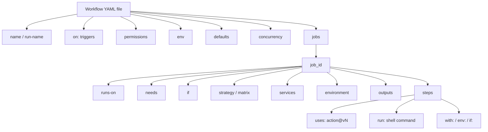

# Workflow File Structure

A GitHub Actions workflow is a YAML file under `.github/workflows/`. This doc walks through every top-level key you can put in one, in the order they typically appear.



---

## 1. `name`
Human-readable name shown in the Actions UI. Optional; defaults to the file path.

```yaml
name: CI
```

## 2. `run-name`
Per-run title (supports expressions). Useful for distinguishing runs in lists.

```yaml
run-name: Deploy ${{ inputs.environment }} by @${{ github.actor }}
```

## 3. `on:` — triggers
Defines what events start the workflow. Can be a string, list, or map. See [`actions-settings.md`](./actions-settings.md) for the full event list and `protection-steps.md` for filtering tips.

```yaml
on:
  push:
    branches: [main]
    paths: ['src/**']
  pull_request:
    types: [opened, synchronize]
  schedule:
    - cron: '0 6 * * *'
  workflow_dispatch:
    inputs:
      environment:
        type: choice
        options: [staging, production]
```

## 4. `permissions:` — `GITHUB_TOKEN` scopes
Sets the default token scopes for every job. Override per-job too. Minimum viable workflow is `permissions: read-all` or even `contents: read` only.

```yaml
permissions:
  contents: read
  pull-requests: write
```

Common scopes: `actions`, `checks`, `contents`, `deployments`, `discussions`, `id-token`, `issues`, `packages`, `pages`, `pull-requests`, `repository-projects`, `security-events`, `statuses`.

## 5. `env:` — workflow-level environment variables
Available to every step in every job. Override at the job or step level.

```yaml
env:
  NODE_ENV: test
  CI: true
```

## 6. `defaults:` — default `run:` settings
Set shell, working directory, etc., once instead of per step.

```yaml
defaults:
  run:
    shell: bash
    working-directory: ./app
```

## 7. `concurrency:` — serialize or cancel runs
Group runs so only one runs at a time per key. Cancel queued/in-progress runs of the same group.

```yaml
concurrency:
  group: ${{ github.workflow }}-${{ github.ref }}
  cancel-in-progress: true
```

## 8. `jobs:` — the actual work
A workflow has one or more jobs. Each job runs on its own runner.

```yaml
jobs:
  build:
    runs-on: ubuntu-latest
    steps:
      - run: echo hi
```

### 8.1 Job keys (one level under each `job_id:`)

| Key | What it does |
| --- | --- |
| `name` | Display name in the UI. |
| `runs-on` | Runner label (`ubuntu-latest`, `windows-latest`, `[self-hosted, linux, gpu]`). |
| `needs` | List of job IDs that must finish first (DAG). |
| `if` | Conditional expression; whole job is skipped when false. |
| `permissions` | Token scopes for this job (overrides workflow-level). |
| `env` | Job-scoped env vars. |
| `defaults` | Job-scoped `run:` defaults. |
| `timeout-minutes` | Hard cap (default 360). |
| `continue-on-error` | Don't fail the run if this job fails. |
| `strategy` | Matrix / fail-fast / max-parallel. |
| `services` | Sidecar Docker containers (DB, Redis, etc.). |
| `container` | Run all steps inside a container image. |
| `environment` | Target deployment environment (gates / secrets). |
| `concurrency` | Per-job concurrency group. |
| `outputs` | Values exposed to downstream jobs via `needs.<id>.outputs`. |
| `steps` | The ordered list of things to do. |
| `uses` | (For reusable workflow callers.) Path/SHA of the workflow to invoke. |
| `with` / `secrets` | Inputs/secrets passed when `uses:` is set. |

### 8.2 `strategy.matrix`
Run the same job N times with different parameters.

```yaml
strategy:
  fail-fast: false
  max-parallel: 4
  matrix:
    node: [18, 20, 22]
    os: [ubuntu-latest, macos-latest]
    include:
      - node: 20
        os: ubuntu-latest
        coverage: true
    exclude:
      - node: 18
        os: macos-latest
```

### 8.3 `services`
Docker containers networked with the job.

```yaml
services:
  mysql:
    image: mysql:8.0
    env:
      MYSQL_ALLOW_EMPTY_PASSWORD: 'yes'
    ports: ['3306:3306']
    options: >-
      --health-cmd="mysqladmin ping" --health-interval=2s --health-retries=10
```

### 8.4 `environment`
References a configured Environment (reviewers, wait timers, env secrets).

```yaml
environment:
  name: production
  url: ${{ steps.deploy.outputs.url }}
```

### 8.5 `outputs`
Expose data to downstream jobs.

```yaml
jobs:
  build:
    runs-on: ubuntu-latest
    outputs:
      sha: ${{ steps.set.outputs.sha }}
    steps:
      - id: set
        run: echo "sha=$(git rev-parse HEAD)" >> "$GITHUB_OUTPUT"
  deploy:
    needs: build
    runs-on: ubuntu-latest
    steps:
      - run: echo "deploying ${{ needs.build.outputs.sha }}"
```

## 9. `steps:` — the unit of work

Two kinds:

```yaml
steps:
  - name: Checkout
    uses: actions/checkout@v4          # 1. Use a pre-built action
    with:
      fetch-depth: 0

  - name: Build
    run: npm ci && npm run build       # 2. Run a shell command
    shell: bash
    working-directory: ./app
    env:
      VAR: value
    if: github.event_name == 'push'
    timeout-minutes: 10
    continue-on-error: false
    id: build                          # step IDs are used by outputs / needs
```

### Step keys

| Key | Notes |
| --- | --- |
| `id` | For referencing this step's `outputs`/`conclusion`. |
| `name` | Display label. |
| `uses` | Action ref (`owner/repo@vN`, `./local/path`, `docker://image:tag`). |
| `run` | Shell command(s). |
| `with` | Inputs to the action. |
| `env` | Step-scoped env vars. |
| `if` | Conditional expression. |
| `shell` | `bash`, `pwsh`, `sh`, `python`, etc. |
| `working-directory` | Where `run:` executes. |
| `timeout-minutes` | Hard cap on the step. |
| `continue-on-error` | Don't fail the job if this step fails. |

## 10. Reusable workflows (`workflow_call`)
A workflow becomes callable by other workflows when it declares `on: workflow_call:`.

```yaml
on:
  workflow_call:
    inputs:
      node-version: { type: string, required: true }
    secrets:
      npm-token: { required: false }
    outputs:
      build-id:
        value: ${{ jobs.build.outputs.id }}
```

Caller:

```yaml
jobs:
  ci:
    uses: ./.github/workflows/reusable.yml
    with:
      node-version: '20'
    secrets:
      npm-token: ${{ secrets.NPM_TOKEN }}
```

## 11. Expression contexts
Anywhere you write `${{ … }}` you can use:

| Context | Examples |
| --- | --- |
| `github` | `github.actor`, `github.sha`, `github.event.pull_request.number` |
| `env` | `env.NODE_ENV` |
| `vars` | `vars.REGION` (repo/org/env Variables) |
| `secrets` | `secrets.GITHUB_TOKEN`, `secrets.MY_API_KEY` |
| `inputs` | `inputs.environment` (for `workflow_dispatch` / `workflow_call`) |
| `needs` | `needs.build.outputs.sha` |
| `steps` | `steps.<id>.outputs.foo`, `steps.<id>.conclusion` |
| `matrix` | `matrix.node`, `matrix.os` |
| `runner` | `runner.os`, `runner.arch`, `runner.temp` |
| `job` / `jobs` | Status of current job; in reusable callers `jobs.<id>.result`. |

---

## A minimal but complete example

```yaml
name: CI
run-name: CI on ${{ github.ref_name }}

on:
  push:
    branches: [main]
  pull_request:

permissions:
  contents: read

concurrency:
  group: ci-${{ github.ref }}
  cancel-in-progress: true

env:
  NODE_ENV: test

jobs:
  test:
    name: Test (${{ matrix.node }})
    runs-on: ubuntu-latest
    timeout-minutes: 15
    strategy:
      fail-fast: false
      matrix:
        node: [20, 22]
    services:
      redis:
        image: redis:7
        ports: ['6379:6379']
    steps:
      - uses: actions/checkout@v4
      - uses: actions/setup-node@v4
        with:
          node-version: ${{ matrix.node }}
          cache: npm
      - run: npm ci
      - run: npm test
        env:
          REDIS_URL: redis://localhost:6379
```

---

## See also
- [`actions-settings.md`](./actions-settings.md) — every UI setting explained.
- [`protection-steps.md`](./protection-steps.md) — how to block / restrict workflows.
- Workflow trigger examples: `../.github/workflows/01-push.yml` … `14-check-and-misc.yml`.

Authoritative reference: <https://docs.github.com/actions/reference/workflow-syntax-for-github-actions>
